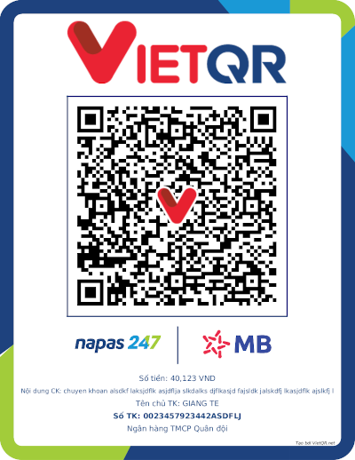

# VietQR
# [](http://godoc.org/github.com/subiz/vietqr)

Sinh mã [VietQR](https://vietqr.net/) cho giao dịch chuyển khoản


## Cài đặt
```
  go get -u github.com/subiz/vietqr
```

## Sử dụng

```go

import (
  "github.com/subiz/vietqr"
)

func main() {
	code := vietqr.Generate(false, "QRIBFTTA", 0, "970423", "0099999999", "ủng hộ lũ lụt")
	fmt.Println(code)
	// 00020101021138540010A00000072701240006970423011000999999990208QRIBFTTA53037045802VN6304CBB4
}
```
### Mô tả cách sinh mã

VietQR là tiêu chuẩn QR thanh toán được phát hành bởi Napas và các ngân hàng thành viên. Website chính thức của nó là vietqr.net. Bạn có thể tìm thấy tài liệu mô tả chi tiết về tiêu chuẩn VietQR ở đó. Tôi cũng đã lưu trữ lại bản gốc trong thư `/spec`. Tài liệu viết chi tiết tuy nhiên có thể sẽ hơi khó hiểu, ở đây tôi tóm tắt lại các ý chính giúp dễ tiêu hóa hơn.



QR Code chúng ta dùng để quét thực chất được sinh ra từ một đoạn văn bản, trông như này
```
00020101021138540010A00000072701240006970423011000999999990208QRIBFTTA53037045802VN6304CBB4
```

Một ví dụ khác:

```
00020101021238630010A0000007270133000697042201190023457923442ASDFLJ0208QRIBFTTA53037045405401235802VN62290825chuyen khoan alsdkf laksj6304E5DB
```

QR Code được cấu thành bởi các đoạn text nhỏ hơn - "đối tượng dữ liệu". Đối tượng dữ liệu dùng để mô tả một thông tin trong giao dịch. Ví dụ số tiền cần chuyển khoản, mã ngân hàng, ...

Ví dụ:

| Đối tượng dữ liệu    | Ý nghĩa                                |
|----------------------|--------------------------------------- |
| `540540999`          | Số tiền chuyển khoản `40999`           |
| `0814ung ho bao lut` | Nội dung chyển khoản `ung ho bao lut`  |

Đối tượng dữ liệu bao gồm 3 thành phần:
1. 2 ký tự đầu: ID của đối-tượng-dữ-liệu, cho biết nó thể hiện thông tin gì.
2. 2 ký tự tiếp: Số lượng ký tự của thông tin.
3. Thông tin raw text.

```
0814ung ho bao lut
```

* ID: 08 (nội dung chuyển khoản)
* Độ dài dữ liệu: 14
* Dữ liệu: ung ho bao lut

Ghi chú: Phần thông tin raw text theo spec là có thể chứa ký tự unicode (mội ký tự unicode tùy vào encoding (utf8) có thể có độ dài là 1, 2 hay 4 byte), nhưng tôi nghĩ để tránh nhức đầu thì khi sinh code bạn hãy (tôi đã) chuyển thành ascii hết, mỗi ký tự có độ dài hằng số là 1.

Đây là một số ID

| ID    | Ý nghĩa                                |
|-------|--------------------------------------- |
| 38    | Thông tin tài khoản thụ hưởng          |
| 53    | Tiền tệ (VND là: `704`)                |
| 54    | Số tiền                                |
| 58    | Mã quốc gia                            |


Một số đối-tượng-dữ-liệu lại được cấu thành bởi các đối-tượng-dữ-liệu nhở hơn. Ví dụ ID 38 (thông tin tài khoản thụ hưởng):

`38` `57` `0010A00000072701270006970422011300234579234420208QRIBFTTA`

Phần dữ liệu con được tổ chức thay layout tương tự: `ID``Độ dài``Dữ liệu`. Với ví dụ ở trên, phần dữ liệu `0010A00000072701270006970422011300234579234420208QRIBFTTA` sẽ được dịch là

`00` `10` `A000000727` `01` `27` `000697042201130023457923442` `02` `08` `QRIBFTTA`

* Đối tượng dữ liệu đầu tiên là `00`, độ dài `10`, thông tin là `A000000727`
* Đối tượng dữ liệu tiếp theo là `01`, độ dài `27`, thông tin là `000697042201130023457923442`
* Đối tượng cuối cùng `02`, độ dài `08`, thông tin là `QRIBFTTA`


Mã VietQR ứng với giao dịch như sau:

* Ngân hàng `MBBank`
* STK thụ hưởng `002345792344`
* Số tiền `42123`
* Nội dung chuyển khoản: `ung ho bao lut`

Sẽ được sinh bằng các bước dưới đây:

Bước 1: Ghi lại Payload Format Indicator - phiên bản dữ liệu (ID 0)

`00` `02` `01`

Bạn sẽ để ý thấy rằng mã QR code nào cũng bắt đầu bằng chuỗi trên, ý nghĩa của nó là VietQR code version 1

Bước 2: Thêm phương thức khởi tạo (ID 1), nếu QR được dùng lại nhiều lần thì mang giá trị `11`, còn muốn quét 1 lần rồi vô hiệu ghi vào là `12`

`01` `02` `11`

Bước 3: Thêm thông tin người thụ hưởng ID 38. Đầu tien cần xác định mã BIN của ngân hàng MB là `970422` -> ghi số này vào ID `00`. Tiếp theo ghi STK thụ hưởng (ID 01): `0006970422``0112002345792344`. Ghi tiếp chuỗi `0208QRIBFTTA` (ID 02 quy định việc chuyển vào thẻ hay TK ngân hàng), cuối cùng đếm số ký tự và bọ trong ID 38


`38` `38` `000697042201120023457923440208QRIBFTTA`


Bước 4: thêm mã tiền tệ (ID 53): `704` (VND)

```
5303704
```

Bước 5: Thêm số tiền giao dịch (ID 54), viết liền không cách, ví dụ: `18.000`

```
5406180000
```

Bước 6: Thêm mã quốc gia ID 58

```
5802VN
```

Bước 7: Thêm ghi chú, ghi chú là thông tin con ID 08 của thông "tin thông tin bổ xung" ID 62. Viết ghi chú trước `0814ung ho bao lut`, sau đó đếm độ dài rồi bọc trong ID 01

```
62160814ung ho bao lut
```

Bước 8 Thêm mã CRC ID 63

```
6304E69F
```

Cuối cùng ta được

```
0002010102113838000697042201120023457923440208QRIBFTTA530370454061800005802VN62160814ung ho bao lut6304E69F`
```

### Thông tin chiếu

1. List of Bank BIN codes
https://sbv.gov.vn/webcenter/portal/vi/menu/trangchu/ttsk/ttsk_chitiet?leftWidth=20%25&showFooter=false&showHeader=false&dDocName=SBVWEBAPP01SBV078451&rightWidth=0%25&centerWidth=80%25&_afrLoop=1905600929218755#%40%3F_afrLoop%3D1905600929218755%26centerWidth%3D80%2525%26dDocName%3DSBVWEBAPP01SBV078451%26leftWidth%3D20%2525%26rightWidth%3D0%2525%26showFooter%3Dfalse%26showHeader%3Dfalse%26_adf.ctrl-state%3D81159st5g_9

### Website VietQR

Tôi chỉ thấy NAPAS đề cập tới webiste VietQR và trang web của nó là `vietqr.net`. Nhưng khi search `vietqr` trên Google các kết quả top đầu thường là:
```
vietqr.vn
vietqr.io
```

Tôi không biết các đơn vị này có thuộc Napas hay không, tôi đã thử tìm kiếm kỹ và không tìm được link nào của Napas đề cập tới những website trên cả. Tôi cho rằng 99% đây là những đơn vị cá nhân độc lập. Tôi viết để cảnh báo bạn hãy thận trọng khi đọc những thông tin từ họ, đừng nhầm tưởng họ là đại diện của Napas.

## License [](https://opensource.org/licenses/MIT)
MIT
